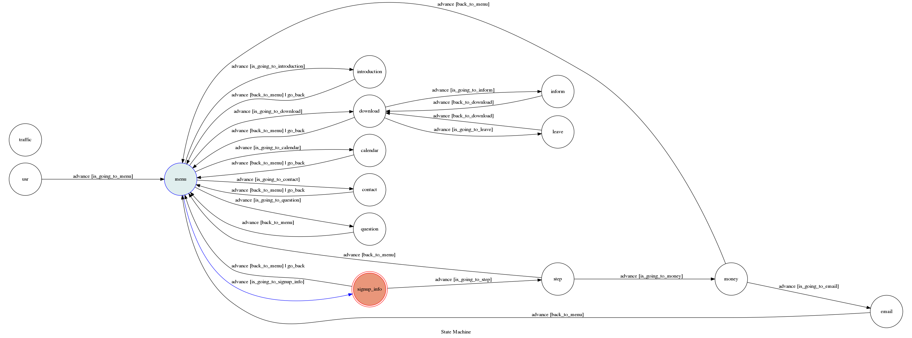

# TOC Project 2019

A Facebook messenger bot based on a finite state machine

Name：陳韋志

Student ID: F74052269

## Setup

Use the setup and template code from TA

This bot has been deployed(bonus) on Heroku, you can go to this [fanpage](https://www.facebook.com/2018%E8%B3%87%E5%B7%A5%E7%87%9F-360855851156668/) to use the chat bot.

If you want to run locally, you need to write in the tokens and run `ngrok` with `app.py`.

## Finite State Machine

## Usage
This messenger bot is used to answer some easy questions and provide information about the camp on the fanpage of the camp.

這個 messenger bot 用於資訊營粉絲專頁的 messenger，可以回答一些跟營隊有關的問題以及提供一些相關資訊給使用者。

I will introduce my bot through the states, referenced to the picture above.

* Initial state:
The initial state is set to `user`, input "hi" or "Hi" to enter the actual initial state `menu`. There are 6 states that can be reached from the `menu` state:
	+ 報名資訊(signup_info)
	+ 營隊介紹(introduction)
	+ 附件下載(download)
	+ 行事曆(calender)
	+ 聯絡方式(contact)
	+ 其他問題(question)

Every state has a "返回主目錄(return)" button which allows users to go back to `menu` state.

* 報名資訊(signup_info):

This state shows the "information" and the "steps" of signing-up.

There are totally 3 steps for signing-up, so there are 3 states after the sign_up state. The 3 steps are in order and each can reached by its previous state.

Of course, return buttons are provided under the states.

* 營隊介紹(introduction):

This state shows the introduction of this camp, and there is a button below that is a link to the website of our CSIE.

* 附件下載（download)

This state has 2 following states that are different files to be downloaded. And I use 2 quick_reply button to show them.

* 行事曆(calender)

This state shows the schedule of the camp.

* 聯絡方式(contact)

This state shows the contact information of the camp.

* 其他問題(question)

This state is left for the user to type questions that will be read by the fanpage manager.

