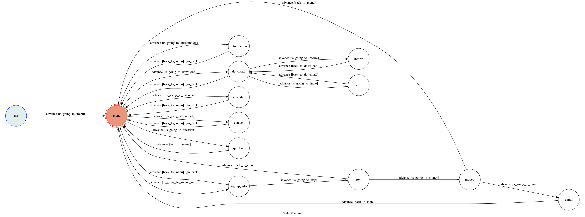

# TOC Project 2019

A Facebook messenger bot based on a finite state machine

Name：陳韋志

Student ID: F74052269

## Setup

Use the setup and template code from TA

This bot has been deployed(bonus) on Heroku, you can go to this [fanpage](https://www.facebook.com/2018%E8%B3%87%E5%B7%A5%E7%87%9F-360855851156668/) to use the chat bot.

If you want to run locally, you need to write in the tokens and run `ngrok` with `app.py`.

## Finite State Machine

## Usage
The initial state is set to `user`, input "hi" or "Hi" to enter the actual initial state `menu`.

## Usage
The initial state is set to `user`.

Every time `user` state is triggered to `advance` to another state, it will `go_back` to `user` state after the bot replies corresponding message.

* user
	* Input: "go to state1"
		* Reply: "I'm entering state1"

	* Input: "go to state2"
		* Reply: "I'm entering state2"

## Reference
[TOC-Project-2017](https://github.com/Lee-W/TOC-Project-2017) ❤️ [@Lee-W](https://github.com/Lee-W)
